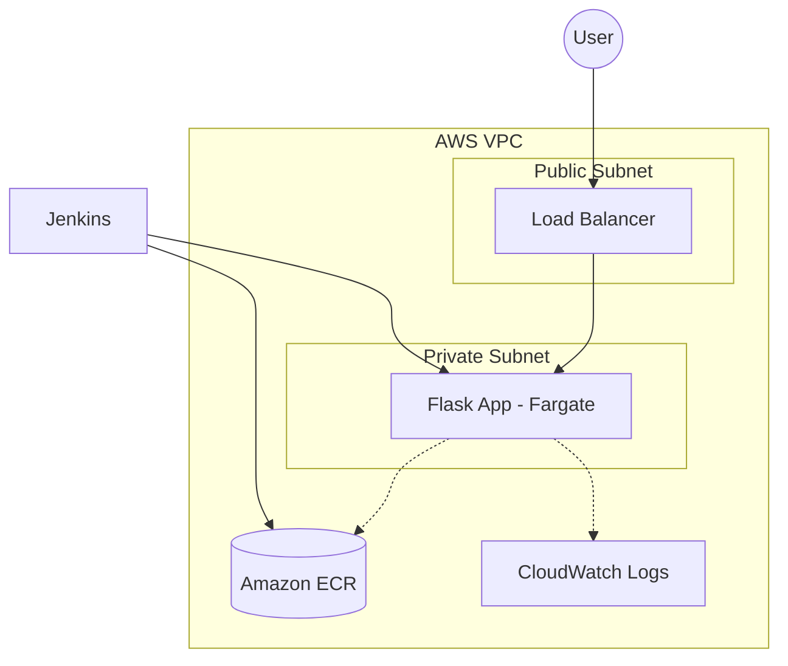

# Damolak Challenge: Production-Ready AWS Deployment

## Introduction
This repository contains my submission for the DevOps Engineer Practical Challenge. My goal was to build a system that reflects real-world production standards: secure by design, fully automated, and easy for a team to maintain and scale.

The architecture centers on a Python/Flask application deployed via AWS ECS Fargate. I chose Fargate to leverage container orchestration without the operational burden of managing the underlying EC2 fleet, allowing the focus to remain on the application and delivery pipeline.

## Project Components
- **Application:** A clean Flask API including health check endpoints.
- **Infrastructure (IaC):** Modular Terraform configurations that provision a custom VPC and the required compute resources.
- **CI/CD:** A declarative Jenkins pipeline managing the full lifecycle from testing to deployment.
- **Automation:** A deployment script to bootstrap the infrastructure and initial image push.

## Architectural Approach
The network design follows the principle of least privilege to ensure a secure foundation:
- **Public Subnets:** These house the Application Load Balancer (ALB), which acts as the single entry point for external traffic.
- **Private Subnets:** The application containers are isolated here. They are not directly accessible from the internet, significantly reducing the attack surface.
- **Observability:** Centralized logging is handled via Amazon CloudWatch, ensuring that application and infrastructure logs are readily available for monitoring and troubleshooting.



## Getting Started

### 1. Infrastructure Provisioning
The initial setup is automated to ensure a repeatable and error-free deployment. Ensure your AWS CLI is configured before running:
```bash
chmod +x scripts/deploy.sh
./scripts/deploy.sh
```
This script initializes Terraform, applies the configuration, and pushes the initial Docker image to ECR.

### 2. CI/CD Pipeline
After the infrastructure is provisioned:
1. Create a Pipeline job in Jenkins and point it to this repository.
2. Store your `aws-account-id` as a secret credential in Jenkins.
3. Run the pipeline to execute tests, build the image, and update the ECS service.

## Design Decisions and Rationale
- **Why Fargate?** Managed compute reduces the "undifferentiated heavy lifting" of server maintenance, allowing a DevOps team to focus on high-value tasks like pipeline optimization and security.
- **Why Private Subnets?** Security is a foundational requirement, not an optional add-on. Isolating the application layer is a standard best practice for production environments.
- **Why Terraform?** It provides a version-controlled source of truth for the infrastructure, making the environment predictable, repeatable, and easy to audit.

## Additional Notes
- A NAT Gateway is utilized to allow tasks in private subnets to pull images from ECR.
- A `.dockerignore` file is included to ensure lean and efficient container builds.
- Resource naming throughout the project is consistent with the `damolak-challange` repository name.

---
*If you have any questions regarding the architectural choices or the deployment process, please feel free to reach out.*
