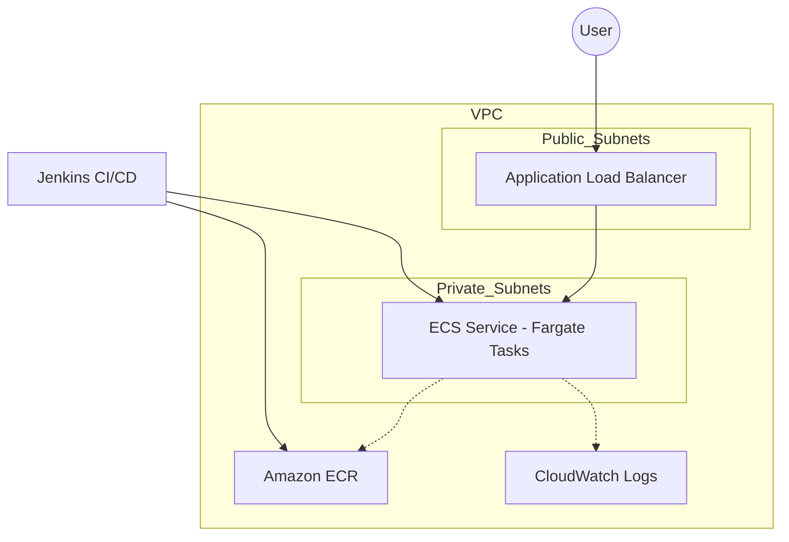

# DevOps Practical Challenge: Production-Ready AWS Deployment

## Intro
Hey there! This is my submission for the DevOps Engineer Practical Challenge. I've put together a system that focuses on being "production-ready"—meaning it's not just about getting code to run, but making sure it's secure, automated, and easy to maintain.

I decided to go with a **Python/Flask** app deployed on **AWS ECS Fargate**. I chose this path because it balances scalability with low operational overhead—no need to babysit EC2 instances.

## What's in the Box?
- **App:** A simple Flask API (because simplicity is clear).
- **IaC:** Terraform scripts to spin up the whole AWS environment.
- **CI/CD:** A Jenkinsfile that handles the heavy lifting (testing, building, and deploying).
- **Automation:** A quick `deploy.sh` script to get everything started without clicking around the AWS console.

## The Architecture (How it works)
I followed a "security-first" approach for the network:
- **Public Subnets:** Only the Load Balancer lives here. It's the only part that talks to the internet.
- **Private Subnets:** The application containers live here, totally isolated.
- **Registry & Logs:** Images are stored in ECR, and logs flow directly into CloudWatch so you can actually see what's happening in the containers.



## How to run this
### 1. The Quick Start (Terraform)
I've included a script to automate the initial setup. Just make sure your AWS CLI is configured:
```bash
chmod +x scripts/deploy.sh
./scripts/deploy.sh
```
This will spin up the VPC, ECS cluster, and push the first version of the app.

### 2. Jenkins Pipeline
Once the infrastructure is up:
1. Point your Jenkins job to this repo.
2. Make sure your Jenkins has the `aws-account-id` credential.
3. Hit 'Build' and watch it go!

## My Design Thinking (The "Why")
- **Why Fargate?** In a real production environment, I want my team focused on the app, not patching OS kernels on EC2 nodes.
- **Why Private Subnets?** Even for a simple challenge, I believe in starting with a secure foundation. No app should be directly exposed if it doesn't have to be.
- **Why Jenkins?** It's the industry standard for a reason. I used a Declarative Pipeline because it's easier to read and version-control.

## Assumptions & Notes
- I assumed a NAT Gateway is acceptable for this setup (needed for the private subnets to reach ECR).
- The Jenkins server is assumed to be outside this VPC but with proper IAM permissions.

---
*If you have any questions about my choices or how to run this, feel free to reach out!*
