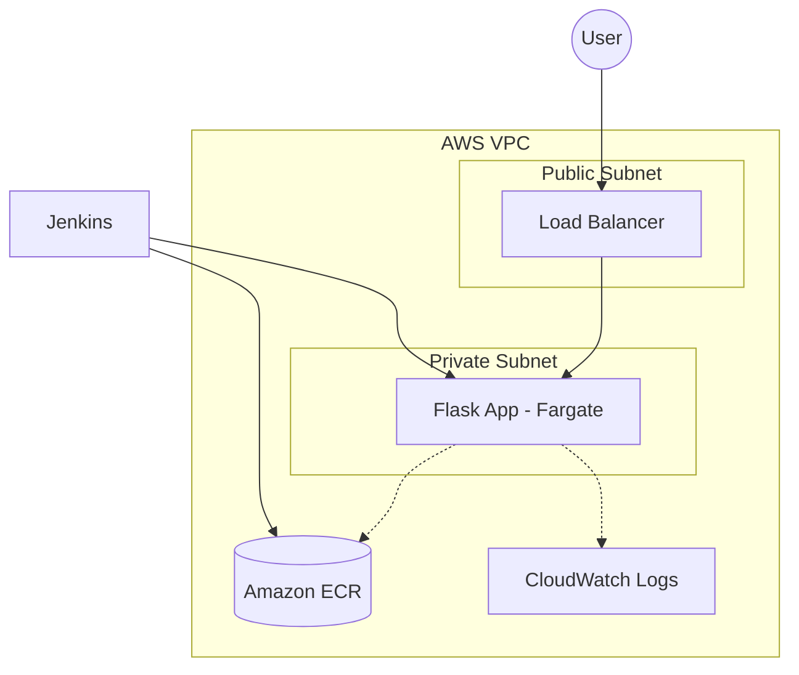

# Damolak Challenge: Production-Ready AWS Deployment

## 👋 Introduction
Hey! Thanks for taking the time to look at my submission. For this challenge, I wanted to build something that feels "real." To me, that means a setup that doesn't just work on my machine, but is secure, easy for a teammate to understand, and—most importantly—automated so we don't have to do "click-ops" in the AWS console.

I went with a **Python/Flask** app running on **AWS ECS Fargate**. I’m a big fan of Fargate because it gives us the power of containers without the headache of managing the underlying servers. It’s all about focusing on the code.

## 🛠️ What's Under the Hood?
- **The App:** A clean Flask API with health checks.
- **Infrastructure (IaC):** Terraform modules that build a "security-first" VPC from scratch.
- **CI/CD:** A Jenkins pipeline that handles the whole lifecycle (Test -> Build -> Push -> Deploy).
- **The "Easy Button":** A `deploy.sh` script to kick everything off.

## 🏗️ How I Built the Network
I followed the principle of least privilege here:
- **Public Subnets:** Only the Application Load Balancer (ALB) lives here. It's our "front door."
- **Private Subnets:** The app containers are tucked away here, totally isolated from the public internet. They can only talk to what they need to.
- **Observability:** Logs go straight to CloudWatch. If something breaks, we'll see exactly why in the logs.



## 🚀 Let's Get It Running
### 1. Initial Setup
I've automated the infrastructure provisioning. Just make sure your AWS CLI is ready to go:
```bash
chmod +x scripts/deploy.sh
./scripts/deploy.sh
```
This script handles the Terraform `init/apply` and even pushes the first version of the app to ECR for you.

### 2. The Jenkins Pipeline
Once the infrastructure is live:
1. Create a Pipeline job in Jenkins pointing to this repo.
2. Add your `aws-account-id` as a secret in Jenkins.
3. Build! It’ll run the tests, build the image, and deploy to ECS.

## 🧠 My Design Thinking (The "Why")
- **Why Fargate?** Honestly, I'd rather spend my time improving the pipeline than patching Linux kernels on EC2 instances. It's more efficient for a production team.
- **Why Private Subnets?** Even for a sample app, I believe in building the right way from day one. Security isn't something you "add on" later.
- **Why Terraform?** It's our "source of truth." If we need to replicate this environment in another region, it's just a 2-minute job.

## 📝 A Few Notes
- I assumed a NAT Gateway is fine for this setup (it's needed for the private tasks to pull from ECR).
- I included a `.dockerignore` to keep our images small and fast.
- I've named everything `damolak-challange` to keep it consistent with the repo.

---
*I'm really excited about this setup and would love to chat about any part of it. Thanks for the opportunity!*
