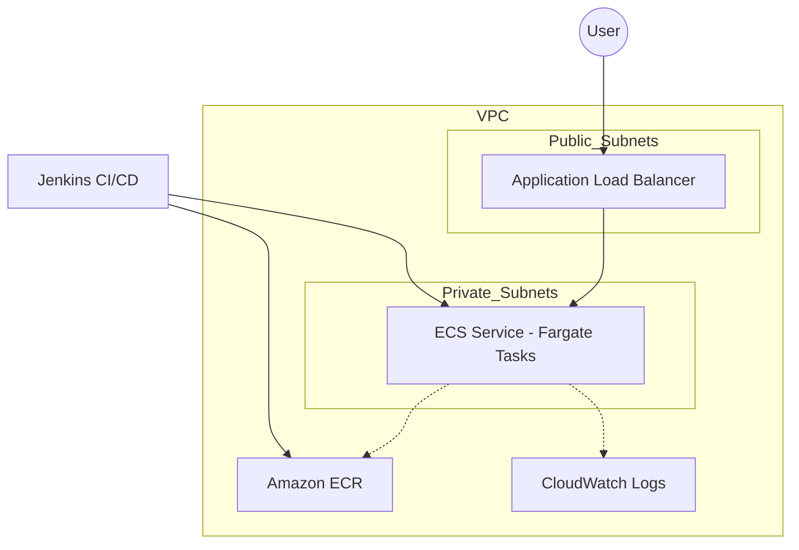

# DevOps Engineer Practical Challenge - Production-Ready Deployment

## Overview
This project demonstrates a production-ready application deployment on AWS using modern DevOps practices. It features a Python/Flask API containerized with Docker, infrastructure provisioned via Terraform, and a CI/CD pipeline managed by Jenkins.

## Architecture
The architecture follows AWS best practices for security and scalability:

- **VPC:** Custom VPC with 2 public subnets (for ALB) and 2 private subnets (for ECS tasks).
- **Compute:** Amazon ECS using AWS Fargate (serverless containers).
- **Networking:** Application Load Balancer (ALB) for traffic distribution.
- **Registry:** Amazon ECR for Docker image storage.
- **Monitoring:** CloudWatch Log Groups for application and infrastructure logs.
- **Security:** Security Groups for least-privilege access; IAM roles for ECS task execution.

### Architecture Diagram


## Prerequisites
- AWS Account and CLI configured.
- Terraform (v1.5+ recommended).
- Docker.
- Jenkins (with Docker, Pipeline, and AWS Credentials plugins).

## Deployment Steps

### 1. Infrastructure Provisioning
You can use the provided automation script:
```bash
chmod +x scripts/deploy.sh
./scripts/deploy.sh
```
Or manually:
```bash
cd terraform
terraform init
terraform apply
```
*Note the `alb_hostname` and `ecr_repository_url` outputs.*

### 2. CI/CD Setup (Jenkins)
1. Create a new "Pipeline" job in Jenkins.
2. Add the following credentials:
   - `aws-account-id`: Secret text (Your AWS Account ID).
   - AWS Credentials for the Jenkins node to interact with AWS (IAM User/Role with ECR/ECS permissions).
3. Point the pipeline to the GitHub repository containing the `Jenkinsfile`.
4. Run the pipeline. It will:
   - Run unit tests.
   - Build and push the Docker image to ECR.
   - Deploy the new version to the ECS Service.

## Design Decisions
- **Fargate over EC2:** Chosen to minimize operational overhead. Fargate handles the underlying infrastructure, allowing us to focus on the application.
- **VPC Design:** Using public subnets for the Load Balancer and private subnets for the application tasks ensures that the application is not directly reachable from the internet, significantly reducing the attack surface.
- **Stateless Application:** The Flask app is designed to be stateless, enabling horizontal scaling across multiple availability zones.
- **Infrastructure as Code (Terraform):** Using Terraform ensures the infrastructure is version-controlled, repeatable, and avoids "configuration drift" associated with manual changes in the AWS Console.
- **CloudWatch Logging:** Integrated `awslogs` for real-time monitoring and debugging without needing to SSH into containers.

## Assumptions
- The AWS IAM user/role running Terraform has sufficient permissions to create VPCs, ECS clusters, and ECR repositories.
- Jenkins is hosted on a server that has Docker installed and has network connectivity to AWS APIs.
- A NAT Gateway is provisioned to allow ECS tasks in private subnets to pull images from ECR.

## Clean-up
To avoid ongoing AWS costs, destroy the infrastructure:
```bash
cd terraform
terraform destroy
```
